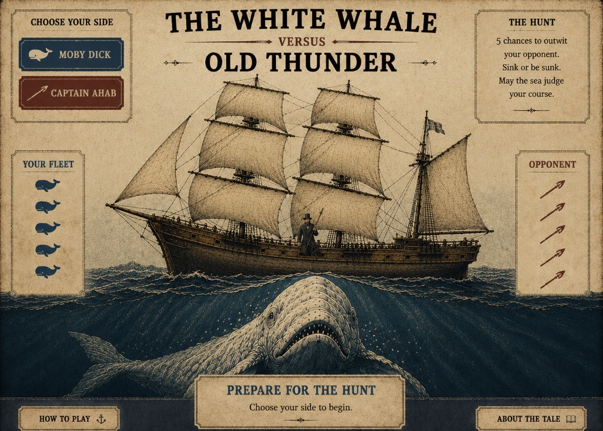

# [The White Whale versus Old Thunder](https://samobrienolinger.github.io/the-white-whale-vs-old-thunder/)

## [▶ Play the live interactive game](https://samobrienolinger.github.io/the-white-whale-vs-old-thunder/)

<a href="https://samobrienolinger.github.io/the-white-whale-vs-old-thunder/">
  
</a>

A mobile-first, Battleship-inspired browser game built in plain HTML, CSS and JavaScript.

At the start of each chase, choose to command either Moby Dick or Captain Ahab—"Old Thunder". Your quarry occupies a five-cell run on the 7×7 coordinate grid (A–G and 1–7), and you have five coordinate choices to land three decisive strikes.

- As **Moby Dick**, three breaches sink the Pequod.
- As **Captain Ahab**, three harpoons bring down Moby Dick.

The game page now uses the same illustrated maritime visual language and approved Ahab/Moby artwork as the landing page so the experience remains visually consistent from entry through gameplay.

The game’s updated prompts draw on the supplied summaries of [Captain Ahab](https://en.wikipedia.org/wiki/Captain_Ahab), [*Moby-Dick*](https://en.wikipedia.org/wiki/Moby-Dick), and [Moby Dick as a white sperm whale](https://en.wikipedia.org/wiki/Moby_Dick_(whale)).

## Visual inspiration

The design of the Pequod was inspired by this ship artwork by Lars Platoon on Instagram:
https://www.instagram.com/p/DSiOfq8jwdM/?igsi=cGFmcmR4bmg3MHBk

## Run locally

Open `index.html` through a local web server. For example:

```bash
python3 -m http.server 8000
```

Then visit `http://localhost:8000`.

## Test

```bash
npm test
npm run test:e2e
```

The browser tests use Playwright as a development dependency.
