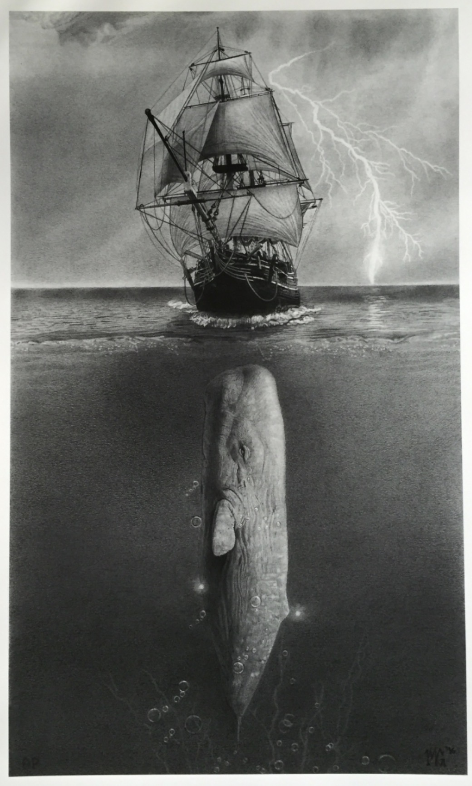

# The White Whale versus Old Thunder

An accessible, mobile-first coordinate-hunt game inspired by the final chase in Herman Melville's *Moby-Dick*.

## [Play the live game](https://samobrienolinger.github.io/the-white-whale-vs-old-thunder/)

<a href="https://samobrienolinger.github.io/the-white-whale-vs-old-thunder/">
  
</a>

Choose **Moby Dick** or **Captain Ahab**, search the voyage map and land two true strikes before your five chances are spent.

| Game detail | Value |
| --- | --- |
| Playable roles | Moby Dick and Captain Ahab |
| Sea chart | 7 × 7 coordinates, A1 to G7 |
| Chances | 5 per chase |
| Hits required | 2 |
| Hidden quarry | A contiguous five-square run |

## How to play

1. Choose **Moby Dick** or **Captain Ahab** on the landing page.
2. Select **Begin the Hunt**.
3. Choose a coordinate on the 7 × 7 sea chart.
4. Use the directional and proximity clue after a miss to guide your next move.
5. Land two hits within five chances to win.

### Moby Dick

Direct the White Whale's breaches toward the hidden Pequod. Two true breaches sink the ship.

### Captain Ahab

Cast Ahab's harpoons toward the hidden White Whale. Two true harpoons bring Moby Dick down.

## Features

- Two complete role-specific game paths, narratives and outcomes.
- Five-chance matches designed for short mobile play sessions.
- Directional and proximity clues after missed coordinates.
- A historical voyage map visible beneath the interactive grid.
- Clear hit, miss, remaining-chance and damage feedback.
- Replay and change-side controls without reloading the page.
- Responsive nineteenth-century maritime visual design.
- Static frontend with no account, tracking or backend requirement.

## Accessibility

The interface includes accessibility-focused behavior that is covered by automated source and browser tests:

- Semantic HTML buttons and dialogs.
- Accessible names for role choices and every coordinate.
- Keyboard navigation across the board with the arrow keys.
- Enter and Space activation for coordinate strikes.
- Visible keyboard focus states.
- Live status announcements after each move.
- Updated screen-reader labels for hit and miss results.
- An accessible damage progress meter.
- Focus management when gameplay, dialogs and role selection change.
- 44-pixel mobile coordinate targets.
- Reduced-motion support.

## Technology

- HTML5
- CSS3
- Modern JavaScript modules
- Vite for local development
- Node's built-in test runner
- Playwright for desktop and mobile browser tests
- GitHub Actions for continuous integration
- GitHub Pages for hosting

No frontend framework or production build step is required.

## Project structure

```text
.
├── assets/images/              # Landing, gameplay, map and role artwork
├── e2e/site.spec.js            # Playwright user-flow tests
├── test/                       # Source/accessibility and game-engine tests
├── game-engine.js              # Board generation, strikes and clues
├── landing.js                  # Role selection and landing-page behavior
├── script.js                   # Game UI, narration and state rendering
├── styles.css                  # Core responsive presentation
├── blueprint.css               # Maritime visual treatment
├── index.html                  # Single-page application markup
└── .github/workflows/ci.yml    # Automated test workflow
```

## Run locally

### Requirements

- Node.js 20 or newer
- npm

### Installation

```bash
git clone https://github.com/SamOBrienOlinger/the-white-whale-vs-old-thunder.git
cd the-white-whale-vs-old-thunder
npm install
npm run dev
```

Open the local address shown by Vite.

The site can also run from any static web server because the production application uses plain HTML, CSS and JavaScript.

## Testing

Run the unit, game-engine, source and accessibility checks:

```bash
npm test
```

Run the Playwright desktop and iPhone-sized browser journeys:

```bash
npx playwright install chromium
npm run test:e2e
```

The GitHub Actions workflow runs both suites for pushes and pull requests targeting `main`.

## Deployment

The production site is hosted through GitHub Pages:

**https://samobrienolinger.github.io/the-white-whale-vs-old-thunder/**

Changes merged into `main` are tested by GitHub Actions and published through the repository's Pages configuration.

## Visual and literary credits

- The game is an unofficial creative interpretation of Herman Melville's public-domain novel [*Moby-Dick; or, The Whale*](https://en.wikipedia.org/wiki/Moby-Dick).
- Character background: [Captain Ahab](https://en.wikipedia.org/wiki/Captain_Ahab).
- Pequod design reference: [ship artwork by Lars Platoon on Instagram](https://www.instagram.com/p/DSiOfq8jwdM/?igsi=cGFmcmR4bmg3MHBk).
- Additional Moby Dick and Pequod visual reference: [Moby Dick Large on Storenvy](https://www.storenvy.com/products/17731562-moby-dick-large).
- Several interface illustrations and role icons were generated or refined with OpenAI image tools from user-approved visual references.

This project is not affiliated with the creators, publishers or sellers linked above. Referenced third-party material remains subject to its original owner's terms.

## License

The repository is released under [CC0 1.0 Universal](LICENSE).
